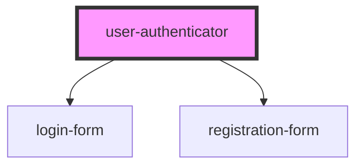

# my-component

<!-- Auto Generated Below -->

## Properties

| Property     | Attribute     | Description | Type     | Default   |
| ------------ | ------------- | ----------- | -------- | --------- |
| `defaultTab` | `default-tab` |             | `string` | `'login'` |

## Dependencies

### Depends on

- [login-form](../login-form)
- [registration-form](../registration-form)

### Graph

----------------------------------------------

*Built with [StencilJS](https://stenciljs.com/)*
